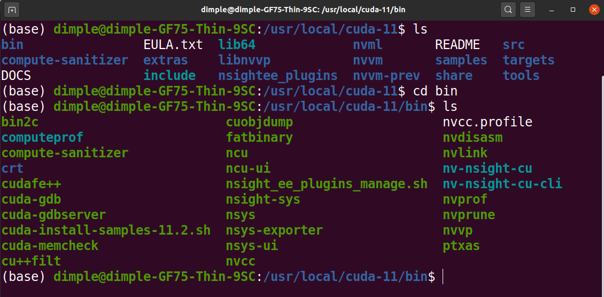
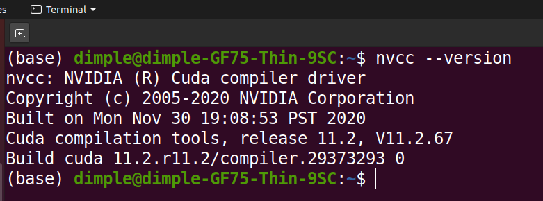
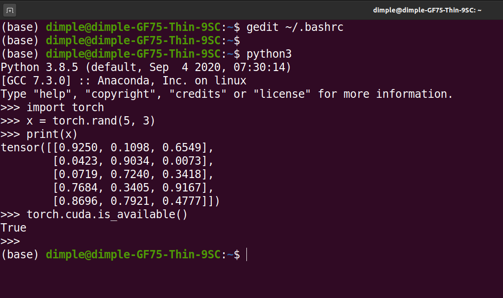

# Ubuntu 20
Anaconda [installation](https://linuxize.com/post/how-to-install-anaconda-on-ubuntu-20-04/)
<br/>
Installation of cuda via [deb(network)](https://developer.nvidia.com/cuda-downloads?target_os=Linux&target_arch=x86_64&target_distro=Ubuntu&target_version=2004&target_type=debnetwork) based on your distro, by following instructions in the **Base Installer** section. <br/>


If nvcc --version is empty (meaning cant find cuda)
Add the following line in your bashrc <br/>
```
export CUDA_HOME=/usr/local/cuda-11 # replace this with your path where nvcc is located (not including bin)
export LD_LIBRARY_PATH=${CUDA_HOME}/lib64 

PATH=${CUDA_HOME}/bin:${PATH} 
export PATH 
```
NVCC location in my computer <br/>


Than check again `nvcc --version`


Download tgz file (**cuDNN Library for Linux (x86_64)**) for cudnn from [nvidia page](https://developer.nvidia.com/cudnn)
<br/>

```
tar -xzvf cudnn-11.2-linux-x64-v8.1.0.77.tgz 
sudo cp cuda/include/cudnn*.h /usr/local/cuda/include
sudo cp cuda/lib64/libcudnn* /usr/local/cuda/lib64
sudo chmod a+r /usr/local/cuda/include/cudnn*.h /usr/local/cuda/lib64/libcudnn*
```

after this if you do sudo ldconfig you might have errors like <br/>
`sudo ldconfig /sbin/ldconfig.real: /usr/local/cuda/targets/x86_64-linux/lib/libcudnn_ops_train.so.8 is not a symbolic link` or similar. <br/>

For example: For *libcudnn_ops_train.so.8*, <br/>
```
cd /usr/local/cuda/lib64
ls -lha libcudnn*
```
Find **so.8.1.0** number, it will change depending on cudnn version, do this (replacing libcudnn_ops_train with corresponding sudo ldconfig error file) and run these steps <br/>
```
sudo rm libcudnn_ops_train.so
sudo rm libcudnn_ops_train.so.8
sudo ln libcudnn_ops_train.so.8.1.0 libcudnn_ops_train.so.8
sudo ln libcudnn_ops_train.so.8 libcudnn_ops_train.so
```

Install torch torchvision by <br/>
```
sudo apt install python3-pip
pip3 install torch torchvision
```

Run the following to see if GPU is accessed properly 


# Ubuntu 18
Create (and activate) a new environment, named `cv-nd` with Python 3.6. If prompted to proceed with the install `(Proceed [y]/n)` type y.
Anaconda [installation](https://www.digitalocean.com/community/tutorials/how-to-install-anaconda-on-ubuntu-18-04-quickstart) and [installing](https://medium.com/analytics-vidhya/how-i-installed-cuda-10-0-for-pytorch-in-linux-mint-2ce26dd1930f) cuda 10.1 and cudnn for in-built Nvidia GPU. 
Follow the instructions to setup the enviornment in local GPU:
	- __Linux__ : 
	```
	conda create -n cv-nd python=3.6
	source activate cv-nd
	conda install pytorch torchvision cudatoolkit=10.0 -c pytorch
	pip3 install -r requirements.txt
	```
